# Sistema-de-Recomendación-de-Libros-con-KNN-Nano

Este proyecto implementa un sistema de recomendación de libros utilizando el algoritmo K-Nearest Neighbors (KNN) basado en filtrado colaborativo. El sistema sugiere libros similares a uno dado, utilizando datos de calificaciones de usuarios del conjunto de datos Book-Crossings.

## Características principales

- **Filtrado colaborativo**: Utiliza las calificaciones de usuarios para encontrar patrones de similitud
- **Preprocesamiento inteligente**: Filtra usuarios y libros con pocas calificaciones para mejorar la calidad
- **Métrica de similitud**: Emplea la similitud coseno para encontrar libros relacionados
- **Eficiencia**: Utiliza matrices dispersas (sparse matrices) para manejar grandes conjuntos de datos

## Dependencias

- Python 3.x
- pandas
- numpy
- scikit-learn
- scipy

Instalación:
```bash
pip install pandas numpy scikit-learn scipy
```

## Cómo utilizar

1. Ejecutar el cuaderno Jupyter `fcc_book_recommendation_knn_v2.ipynb`
2. El sistema descargará automáticamente los datos de Book-Crossings
3. Usar la función `get_recommends(título_del_libro)` para obtener recomendaciones

Ejemplo:
```python
recommendations = get_recommends("Where the Heart Is (Oprah's Book Club (Paperback))")
print(recommendations)
```

## Flujo de trabajo

```mermaid
graph TD
    A[Datos crudos] --> B[Filtrar usuarios<br>≥200 calificaciones]
    B --> C[Filtrar libros<br>≥100 calificaciones]
    C --> D[Crear matriz usuario-libro]
    D --> E[Entrenar modelo KNN]
    E --> F[Generar recomendaciones]
```



## Estructura del código

### Preprocesamiento de datos
- Filtrado de usuarios activos (≥200 calificaciones)
- Filtrado de libros populares (≥100 calificaciones)
- Construcción de matriz usuario-libro
- Manejo de valores faltantes

### Modelo KNN
```python
model = NearestNeighbors(
    metric='cosine', 
    algorithm='brute', 
    n_neighbors=6
)
model.fit(rating_matrix_sparse)
```

### Función de recomendación
```python
def get_recommends(book_title):
    # Encuentra libros similares
    # Devuelve lista ordenada por similitud
```

## Resultados de ejemplo

Para el libro *"Where the Heart Is (Oprah's Book Club (Paperback))"*:
```
[
  "Where the Heart Is (Oprah's Book Club (Paperback))",
  [
    ["I'll Be Seeing You", 0.8016211],
    ['The Weight of Water', 0.77085835],
    ['The Surgeon', 0.7699411],
    ['I Know This Much Is True', 0.7677075],
    ['The Lovely Bones: A Novel', 0.7234864]
  ]
]
```

## Pruebas
El sistema incluye una función de prueba que verifica:
- Que el libro consultado está en los resultados
- Que los libros recomendados coinciden con los esperados
- Que las distancias de similitud están dentro del rango esperado

Al pasar todas las pruebas se muestra el mensaje:  
`You passed the challenge! 🎉🎉🎉🎉🎉`

## Limitaciones y mejoras futuras
- Incorporar información de contenido (autor, género)
- Implementar sistemas híbridos
- Optimizar para grandes volúmenes de datos
- Crear interfaz de usuario

## Dataset
Los datos provienen de [Book-Crossings Dataset](http://www2.informatik.uni-freiburg.de/~cziegler/BX/), que contiene:
- 278,858 usuarios
- 271,379 libros
- 1,149,780 calificaciones

## Licencia
Este proyecto es parte del plan de estudios de freeCodeCamp y está disponible para fines educativos.


